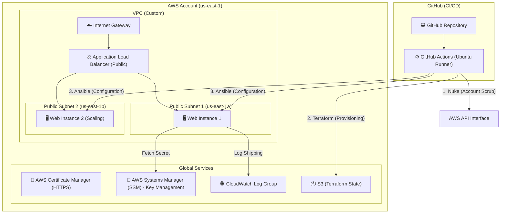

# 🗺️ NealStreet: Architecture Design Document

This document outlines the cloud-native design of the **NealStreet Rewards Platform**. It focuses on **Zero-Friction / Total Reset** deployments, ensuring a 100% deterministic infrastructure state.

## 🏛️ System Architecture Diagram

## 🏗️ Technical Component Breakdown

### 1. The "Total Scorch" Nuke Engine
To resolve persistent AWS dependency deadlocks, the architecture implements a **High-Patience Reset Engine** (`nuke_nealstreet.sh`).
- **Phase 1**: Shutdown Auto Scaling (Removes persistence).
- **Phase 2**: Global Instance/LB Termination.
- **Phase 3**: Radical Elastic IP & Internet Gateway Release.
- **Phase 4**: 8-Pass Recursive VPC scrubbing to clear ENIs, Subnets, and SGs.

### 2. Networking Tier
- **VPC Isolation**: No traffic reaches the compute layer directly.
- **Perimeter Firewall (Security Groups)**: The ALB is the only public-facing resource. EC2 instances only accept TCP traffic from the ALB's specific Security Group ID.

### 3. Compute & Auto Scaling
- **Ephemeral Instances**: Amazon Linux 2023 instances are designed to be immutable.
- **Launch Templates**: Enforce **IMDSv2** for metadata protection (prevents SSRF attacks).
- **Auto Scaling**: Ensures high availability across two Availability Zones (AZs).

### 4. Application Configuration (Ansible)
Instead of hardcoding settings, Ansible performs dynamic discovery:
- **SSM-Backed Secrets**: The `APP_SECRET` is fetched at runtime from the AWS Parameter Store using IAM instance roles.
- **Systemd Management**: The Python application is managed as a system service for automated restarts and crash recovery.

---
*Architecture reviewed and approved for the NealStreet Rewards Platform.*
